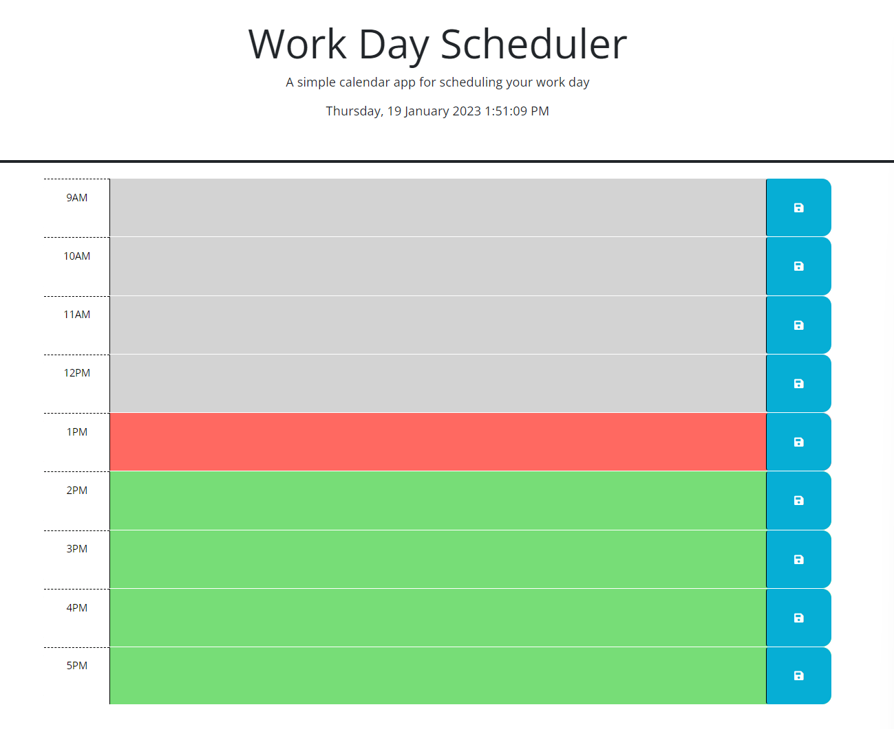

# Module-05-Challenge
Bootcamp Module 05 Challenge - Password Generator

This assignment is to create a simple calendar application that allows a user to save events for each hour of the day by modifying starter code. This app will run in the browser and feature dynamically updated HTML and CSS powered by jQuery.

**The acceptance criteria is as follow :**
- GIVEN I am using a daily planner to create a schedule
- WHEN I open the planner
- THEN the current day is displayed at the top of the calendar
- WHEN I scroll down
- THEN I am presented with timeblocks for standard business hours
- WHEN I view the timeblocks for that day
- THEN each timeblock is color coded to indicate whether it is in the past, present, or future
- WHEN I click into a timeblock
- THEN I can enter an event
- WHEN I click the save button for that timeblock
- THEN the text for that event is saved in local storage
- WHEN I refresh the page
- THEN the saved events persist

**Creator Note:**
1. Added running timer
2. Original comments were removed
3. Below is an example of the website ;

**Credits for References & Learning Resources:**
1. Website Credits - W3schools
2. Website Credits - StackOverFlow
3. Website Credits - Markdownguide.org

This project is for Private use/learning classes and not for commerical or public consumption.

Thank you
End.        

